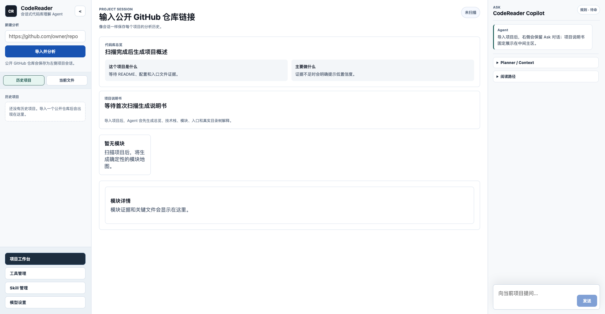
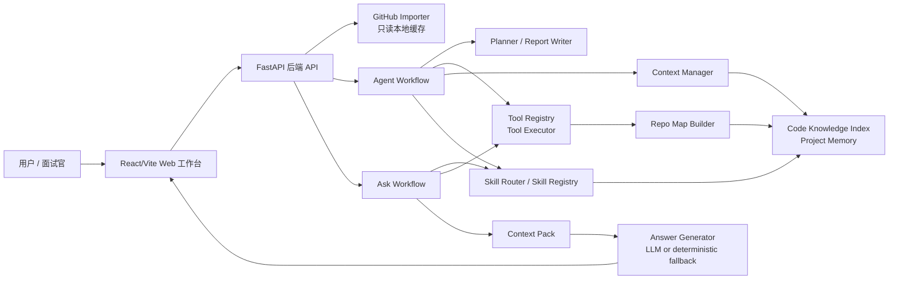
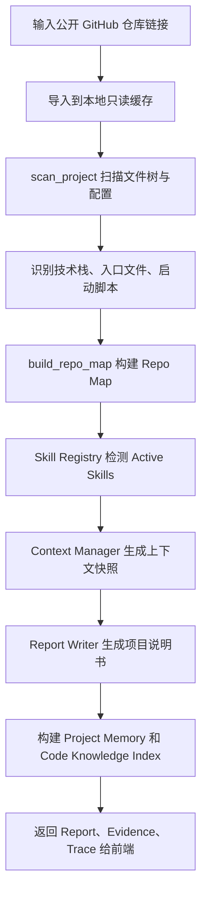
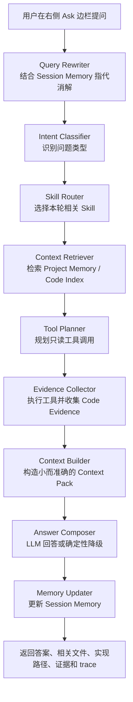

# CodeReader Agent

## 1. 项目简介

CodeReader Agent 是一个本地运行的代码库理解 Agent。用户输入公开 GitHub 仓库链接后，系统会将仓库导入到本地只读缓存，自动扫描目录结构、识别技术栈、构建 Repo Map，并生成一份可导航、可追踪、可复用的项目说明书。

该项目聚焦于解决“如何快速读懂一个陌生仓库”的问题。它先通过 Planner、只读工具调用、上下文管理、Skill 路由和代码知识索引生成项目级理解报告，再进入 Ask 模式，让用户围绕项目说明书继续追问模块职责、接口位置、调用链候选、配置来源和关键代码依据。

在 Ask 模式中，系统不会把问题直接丢给模型回答，而是先检索 Project Memory、Code Knowledge Index 和 Session Memory；当问题涉及具体实现时，再规划只读工具调用，收集文件路径、代码片段、行号和工具 trace，最终生成带证据的回答。这让 CodeReader Agent 更像一个“会读代码、会留下依据的项目导览工作台”，而不是普通聊天式代码问答。



## 2. 项目背景

开发者接手一个陌生项目时，通常需要先人工判断项目入口、启动方式、核心模块、接口位置、前后端调用关系和推荐阅读顺序。传统文件树只能展示结构，无法解释模块职责；普通代码问答又容易缺少全局认知，甚至根据文件名和经验猜测答案。

CodeReader Agent 将这个过程拆成两个阶段：第一阶段先生成项目级理解报告，沉淀 Project Memory 和 Code Knowledge Index；第二阶段进入 Ask 模式，围绕已有项目记忆、会话记忆和只读工具继续回答追问。每个关键结论都尽量绑定文件路径、代码片段、工具调用记录或索引命中结果。

## 3. 核心功能

- 支持输入公开 GitHub 仓库链接，导入到本地 `.codereader/repos` 只读缓存。
- 扫描项目文件树，跳过 `.git`、`node_modules`、构建产物、虚拟环境和缓存目录。
- 解析 `package.json`、`pom.xml`、`build.gradle` 等配置，识别包管理器、启动脚本、Java 构建工具和依赖。
- 识别 Vue / Vite / TypeScript / Pinia / Vue Router / Axios，以及 Java / Maven / Gradle / Spring Boot / Spring Web / MyBatis 等常见技术栈线索。
- 构建 Repo Map，包含项目摘要、技术栈解释、目录洞察、模块列表、入口文件、文件角色、阅读建议和 evidence。
- 通过 `/api/agent/run` 生成目标驱动项目说明书，返回 Planner 计划、Skill 选择、Context Snapshot、Report 和 Trace Events。
- 报告生成后沉淀 Project Memory，包括项目定位、启动命令、入口、配置文件、模块摘要、文件摘要、API Index、Flow Index、Symbol Index 等。
- Ask 模式通过 LangGraph `StateGraph` 编排问题重写、意图识别、Skill 路由、上下文检索、工具规划、证据收集、Context Pack 构造、回答生成和 Session Memory 更新。
- 运行时 Tool Registry 统一管理 Ask 模式只读工具，支持参数校验、权限校验、路径边界校验、timeout 和调用 trace。
- Web 工作台支持 GitHub 导入、历史项目、文件树、项目说明书、Planner、Skill Registry、Context Snapshot、Trace Logger 和右侧 Ask 边栏。

## 4. 技术栈

- Agent 编排：LangGraph `StateGraph`，本地依赖不可用时使用同顺序 fallback graph。
- 后端服务：Python 3.11+、FastAPI、Pydantic、Uvicorn。
- LLM 接入：LiteLLM，默认读取百炼 OpenAI-compatible 配置，模型名默认 `glm-5.1`。
- 前端页面：React 19、Vite 6、TypeScript。
- 检索 / 索引：确定性 Repo Map、Project Memory、Code Knowledge Index、ripgrep 优先的安全搜索工具，Python 搜索 fallback。
- 数据存储：本地 JSON state，默认 `.codereader/state.json`，可通过 `CODEREADER_STATE_DIR` 覆盖。
- 工具调用：运行时 Tool Registry、Tool Executor、Tool Result Processor、Tool Trace Store。
- 流式输出：当前 API 返回一次性结构化结果；SSE / WebSocket 任务事件流尚未实现。
- 工程化工具：pytest、`python -m compileall`、Vite build、TypeScript compiler。

## 5. 系统架构



整体架构以本地 FastAPI 为中心：前端只负责导入、展示和追问；后端负责只读扫描、Repo Map 构建、Agent 工作流、Project Memory 持久化和 Ask 问答。确定性代码负责扫描、索引、权限边界和证据构造，LLM 只用于项目解释、总结、分类和自然语言回答组织。

## 6. 核心工作流程

### 6.1 项目分析流程



首次分析从 GitHub 导入开始，仓库被 clone 到本地缓存后进入只读扫描流程。扫描结果会被整理为 Repo Map，再由 Skill Registry 根据技术栈激活 `JavaWebSkill`、`SpringBootSkill`、`MyBatisSkill`、`VueSkill`、`RestApiSkill` 等专项 Skill。最终 `/api/agent/run` 返回项目说明书、结构化报告、上下文快照、工具调用记录和 trace，并将 Project Memory 保存到本地 state。

### 6.2 Ask 问答流程



Ask 模式不会把问题直接交给模型，也不会重新全量读取代码库。系统先使用 Project Memory、Code Knowledge Index 和 Session Memory 判断问题上下文；当问题涉及具体实现、接口、文件、类、方法或数据来源时，再通过 Tool Planner 调用只读工具补充证据。最终回答会返回相关文件、候选实现链路、关键代码说明、references、tool calls 和 warnings。

## 7. 核心设计与实现

### 7.1 LangGraph Agent Workflow

Ask 模式使用 LangGraph `StateGraph` 表达有状态工作流，核心状态定义在 `AskState` 中，包含 `project_path`、`question`、`project_memory`、`session_memory`、`resolved_query`、`intent_result`、`routed_skills`、`tool_plan`、`code_evidence`、`context_pack`、`answer`、`tool_calls`、`trace_events` 等信息。

节点按固定顺序协作：`QueryRewriter -> IntentClassifier -> SkillRouter -> ContextRetriever -> ToolPlanner -> EvidenceCollector -> ContextBuilder -> AnswerComposer -> MemoryUpdater`。这种状态机设计让每一步中间结果都能进入 API 响应和前端展示，便于调试“为什么调用这个工具”“为什么选这个 Skill”“最终答案依据了哪些证据”。

首次项目分析的 `/api/agent/run` 目前是一个有边界的只读 LLM tool loop：模型最多调用 `scan_project`、`build_repo_map`、`read_file`、`search_code` 四类工具；当缺少模型配置、模型失败、超预算或输出不合法时，会降级到确定性项目解释，但仍返回完整的 plan、context、report 和 trace。

### 7.2 Tool Registry 工具注册中心

项目中存在两层工具能力：

- 分析入口的最小 LLM tool loop：`scan_project`、`build_repo_map`、`read_file`、`search_code`。
- Ask 模式运行时 Tool Registry：`list_files`、`read_file`、`read_file_chunk`、`get_file_metadata`、`search_keyword`、`search_symbol`、`search_api_path`、`search_file_by_name`、`parse_dependencies`、`parse_package_scripts`、`parse_routes`、`parse_api_calls`、`parse_controller`、`parse_mapper`、`query_project_memory`、`query_code_index`、`query_api_index`、`query_flow_index`、`query_symbol_index`。

每个运行时工具都由 `ToolDefinition` 描述名称、类别、权限、可用模式、输入 schema、风险等级、timeout 和 handler。`ToolExecutor` 在执行前校验 mode、permission、Ask 只读规则、输入 schema 和项目路径边界；Ask 模式只允许 `permission=read`、`risk_level=safe` 且 `available_in_modes` 包含 `ask` 的工具。

工具结果不会原样塞给模型，而是由 `ToolResultProcessor` 转换为 `CodeEvidence`、`EvidenceRef`、related files、implementation path 和摘要信息。`ToolTraceStore` 记录工具名、输入、调用原因、成功状态、输出摘要、耗时和时间戳，使工具调用过程可观察、可追踪。

### 7.3 上下文管理机制

项目通过分层上下文避免“把整个代码库一次性塞进模型”：

- Project Memory：项目定位、描述、项目类型、技术栈、启动命令、入口、构建工具、配置文件、外部依赖、模块和目录摘要。
- Code Knowledge Index：模块摘要、文件摘要、API Index、Flow Index、Symbol Index、Route Index、Frontend API Call Index、Data Model Index、Mapper Relations。
- Session Memory：当前话题、关注模块、关注文件、关注接口、关注流程、上一轮问题和回答摘要。
- Context Pack：本轮 Ask 最终进入 Answer Composer 的小上下文包，包含用户问题、消解后问题、项目上下文、会话上下文和证据片段。

代码层面，Project Memory 由 Repo Map 和项目说明书派生，并保存到本地 JSON state；Session Memory 在每轮 Ask 后更新，用于连续追问和指代消解。Context Pack 设有字符预算，长文件和搜索结果会先被工具处理器裁剪为证据摘要。

### 7.4 Skill 机制与 Skill 路由

Skill 在这个项目中不是单纯 prompt，而是技术栈级代码理解插件。统一接口包含：

- `detect(project)`：判断当前 Repo Map 是否适用。
- `scan(project)`：生成文件摘要、模块摘要、符号、API、流程、路由、前端 API 调用、数据模型和 Mapper 关系候选。
- `get_query_hints(query, session)`：为 Ask 检索补充关键词。
- `plan_tools(query, context)`：为 Tool Planner 建议只读工具调用。
- `get_answer_prompt()`：提供技术栈相关的回答组织提示。

当前内置 Skill 包括 `JavaWebSkill`、`SpringBootSkill`、`MyBatisSkill`、`VueSkill` 和 `RestApiSkill`。首次分析时，Skill Registry 根据技术栈和文件结构检测 active skills 并构建索引；Ask 时，Skill Router 只从 active skills 中选择与当前问题相关的 Skill，避免每一轮都使用所有规则造成噪声。

### 7.5 Code Knowledge Index / Code Evidence

Code Knowledge Index 用于把一次项目分析沉淀成可复用知识结构。它保存模块职责、文件角色、文件符号、接口路径、Controller 候选、前端调用候选、路由候选、流程候选、实体/Mapper 候选等信息。

Ask 回答时，系统会把索引命中和工具结果转成 Code Evidence。一个 evidence 通常包含来源类型、文件路径、符号名、接口路径、内容摘要、代码片段和相关性原因；文件读取和搜索还会提供行号、摘录和来源工具。这样回答可以明确区分“来自项目记忆的候选信息”和“刚刚通过只读工具读取到的真实代码证据”。

## 8. 项目亮点

- 基于 LangGraph 构建可观察的 Ask 状态工作流，把问题重写、意图识别、Skill 路由、工具规划、证据收集和回答生成拆成可追踪节点。
- 设计运行时 Tool Registry 和 Tool Executor，统一管理只读工具的注册、参数校验、权限控制、路径边界、timeout 和 trace。
- 构建 Project Memory + Code Knowledge Index + Session Memory 的分层上下文体系，支持首次报告沉淀和多轮追问复用。
- 通过 Skill Registry 将 Vue、Spring Boot、Java Web、MyBatis、REST API 的扫描、索引、检索 hint 和回答策略模块化。
- 将工具结果统一裁剪为 `CodeEvidence` 和 `EvidenceRef`，让回答能绑定文件路径、行号、代码片段、接口候选和工具调用原因。
- 保留确定性 fallback：即使没有配置 LLM，也能完成扫描、Repo Map、项目说明书、Context Snapshot 和 Trace 展示，保证本地 demo 可运行。

## 9. 快速开始

### 环境要求

- Python 3.11+
- Node.js 18+ 或 20+
- Git
- 可选：`rg` / ripgrep，用于更快的代码搜索；未安装时会使用 Python fallback。
- 可选：百炼 OpenAI-compatible 环境变量，用于真实 LLM 回答。

### 安装后端依赖

```bash
python3 -m venv .venv
source .venv/bin/activate
python -m pip install -e ".[dev]"
```

### 配置环境变量

LLM 是可选能力。未配置时系统会使用确定性 fallback。

```bash
export DASHSCOPE_API_KEY="your-api-key"
export DASHSCOPE_BASE_URL="https://dashscope.aliyuncs.com/compatible-mode/v1"
```

可选本地状态目录：

```bash
export CODEREADER_STATE_DIR="/path/to/local/state"
export CODEREADER_GITHUB_CACHE_DIR="/path/to/local/repos"
```

TODO：仓库当前没有 `.env.example`，环境变量示例暂时只在 README 中说明。

### 启动后端

```bash
PYTHONPATH=src .venv/bin/python -m uvicorn apps.api.main:app --host 127.0.0.1 --port 8000
```

### 启动前端

```bash
cd apps/web
npm install
npm run dev
```

前端默认访问 `http://127.0.0.1:8000`。如需覆盖：

```bash
VITE_API_BASE_URL=http://127.0.0.1:8000 npm run dev
```

### 示例 API 命令

```bash
curl -X POST http://127.0.0.1:8000/api/projects/import-github \
  -H "Content-Type: application/json" \
  -d '{"github_url":"https://github.com/owner/repo"}'
```

```bash
curl -X POST http://127.0.0.1:8000/api/agent/run \
  -H "Content-Type: application/json" \
  -d '{"project_path":"/absolute/path/to/repo","question":"请生成项目说明书"}'
```

```bash
curl -X POST http://127.0.0.1:8000/api/agent/ask \
  -H "Content-Type: application/json" \
  -d '{"project_path":"/absolute/path/to/repo","question":"登录接口在哪里实现？"}'
```

## 10. 使用示例

### 示例一：生成项目说明书

用户输入：

```text
https://github.com/owner/repo
```

系统输出摘要：

```text
已导入公开仓库并生成项目说明书：
- 项目定位与技术栈
- 入口文件和启动命令候选
- 核心模块和目录解释
- 推荐阅读路径
- evidence 和不确定点
```

### 示例二：询问某个模块的作用

用户输入：

```text
这个项目里的 service 模块主要负责什么？
```

系统输出摘要：

```text
意图识别为 module_explanation。
系统优先检索 Project Memory 中的 Module Summary，并按需搜索 service 相关文件。
回答会列出相关文件、模块职责、候选入口和证据来源。
```

### 示例三：询问接口 / 函数调用链

用户输入：

```text
登录接口从前端页面到后端 Controller 大概经过哪些文件？
```

系统输出摘要：

```text
意图识别为 flow_trace / api_lookup。
系统会路由到 VueSkill、SpringBootSkill 或 RestApiSkill，规划 parse_api_calls、parse_controller、search_api_path 等只读工具。
输出前端调用文件、后端 Controller 候选、相关方法和不确定点；当前结果是候选链路，不等同完整 AST 调用链。
```

## 11. 项目结构

```text
.
├── apps/
│   ├── api/                 # FastAPI 本地 API 入口
│   └── web/                 # React + Vite + TypeScript Web 工作台
├── docs/                    # 架构、MVP、工具、Skill、Ask、UI 等设计文档
├── src/code_reader_agent/
│   ├── github_importer.py   # 公开 GitHub 仓库导入到本地只读缓存
│   ├── scanner.py           # 文件树、配置、依赖和技术栈扫描
│   ├── repo_map/            # Repo Map 构建
│   ├── runtime/             # Agent run、Ask mode、LLM client
│   ├── tools/               # 只读工具、Tool Registry、Executor、Trace
│   ├── skills/              # Java/Vue/Spring/MyBatis/REST Skill
│   ├── memory/              # Project Memory 和 Code Knowledge Index 构建
│   ├── local_state.py       # 本地 JSON state、项目会话、模型设置、registry
│   └── models.py            # Pydantic API 和内部数据模型
├── tests/                   # 扫描、Repo Map、工具、Skill、Ask、API 测试
└── pyproject.toml           # Python 包和依赖配置
```

## 12. 后续规划

当前版本优先支持 Java Web、Spring Boot、MyBatis、Vue、Vite 等常见 Java / Vue 前后端项目形态。调用链、接口映射、Mapper 关系目前属于候选级分析，不声明完整 AST 级调用图；系统不自动修改代码、不运行被分析项目命令、不执行 Git 操作。

- 支持更多语言和框架 Skill，例如 React、Next.js、FastAPI、Express。
- 引入更精细的代码依赖图和 AST 级调用链分析，减少候选链路的不确定性。
- 增强调用链、登录流程、页面到 API 数据流的可视化展示。
- 优化长上下文压缩、索引检索排序和证据去重。
- 增加项目级知识库持久化或增量更新机制，避免每次恢复历史项目都重新扫描。
- 增强前端交互体验，例如 evidence 抽屉、工具调用详情、代码片段预览和任务事件流。
